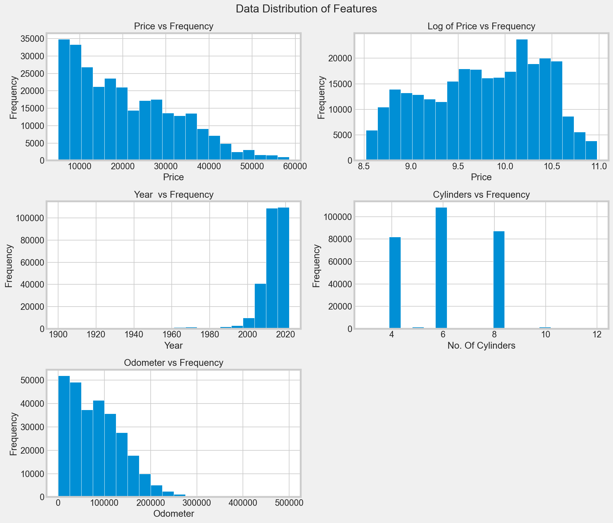
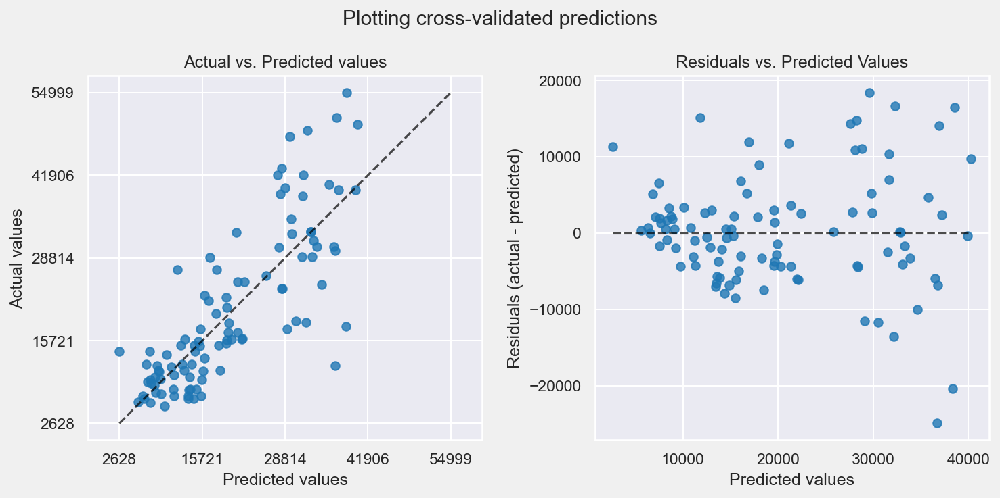

# What drives the price of a car?

[Link to the Jupyter Notebook](https://github.com/Shashidhar-Sathya/carprice/blob/main/what_drives_the_price_of_a_car.ipynb/)

## Introduction - Business Understanding
In United States, the Passenger Car market (New & Used) is massive. 

Annually about :
- 15 million **NEW** passenger cars (sedans, SUVs, hatchbacks etc.) & light trucks (like Toyota Tacoma, Ford-150 etc.) are sold, generating US\$ 636 Billion in sales (2019)
- 39 million **USED** cars are sold, i.e. more than twice the number of NEW cars, totalling around US\$ 841 Billion in sales (2019) 

 

 

The Used car market is primarily driven (pun intented) by large American middle class who own more than 1 car per household. With the virtually non-existant public transport(other than in few Metropolitan cities) having a 2nd car is a 'necessity' rather than a luxury.

Used cars dealers everywhere try to price their used car inventory to maximize their sales based on several factors. Some of the key factors that drive car prices are:
1. Year
2. Manufacturer
3. Make
4. Model
5. Condition (new, likenew, good, excellent)
6. No. Of Cylinders (3,4,6,8 etc.)
7. Fuel Type (gas, diesel, electric etc.)
8. Odometer (mile readings)
9. Title (Clean, Lein, Missing etc.)
9. Transmission (automatic, manual, other)
10. Drive (2WD/4WD)
11. Size (Fullsize, midsize, compact etc.)
12. Type (Pickup, Sedan, SUV etc.)
13. Color (Black, White, Silver etc.)
14. Location

**Bureau of Transportation Statistics - https://www.bts.gov/content/new-and-used-passenger-car-sales-and-leases-thousands-vehicles**

## Objective 
The primary objective of this project is to conduct exploratory data analysis (EDA) on a dataset containing approximately 430,000 historical records of used car sales. Additionally, final goal is to develop a machine learning (ML) or artificial intelligence (AI) model to predict the selling prices of cars based on 
provided input information about the vehicles.

## Data Understanding & Exploratory Data Analysis, 

This section explores the dataset and understand the quality of the data and apply tools and techniques to correct data inconsistancies and missing values.

This also identifies the features that determine the price of a vehicle and can be used to prediction of the vehicle's price.

The processes recommended by CRISP-DM is used wherever necessary.

Ref: CRISP-DM (CRoss Industry Standard Process for Data Mining)

### Data Cleaning and Data Preprocessing 
The data was explored using pandas built in function and following observations were noticed.
1. Dataset has **426880** rows  
2. Run Pandas Profiling Report - ydata ProfileReport
3. Drop rows that do not have 'year' 
4. Remove the 'id' column (to identify duplicate rows across features)
5. Remove duplicate rows (after removing 'id' column)
6. Drop all records where the 'price' is above **$300,000** as they are outliers and have missing/incorrect data in many columns (wrong odometer reading, fuel type, size etc. )
7. Drop all records where 'price' is missing or <= 0
8. **Size can be one of the deciding factors, however as more than 72 percent data is missing**, the feature will not be considered
9. **Manufacturer can be a deciding factor, however the number of unique manufacturers is high, at 43 unique values**, If required, it will be dropped to increase performance of the model. We can run into 'Curse of Dimensionality' problem when Polynomial Features are used.
10. Model data in the dataset is highly fragmented (nearly 30,000 unique values) and cannot be correlated and is dropped
11. Cylinders is having text values. It was converted to numerical values.  Nearly 42\% of data is missing. (*Missing Values were apportioned in the same ratio as the existing ones with existing number of cylinders*).  
12. Condition feature is missing nearly 40\% of the data. (*Missing values were apportioned in the same ratio as exsting condition categories*)
13. Fuel. About 2000 records had missing data. As 'gas' as the most frequently used, it was imputed with 'gas'
14. The following features will not have impact on price, and hence it will be dropped from model bilding
    - VIN (*38%\ missing values*)
    - state
    - Region
    - ID
    - Paint color (*30%\ missing values*)
    - Title_Status
    - Type (*22%\ missing values*)
    - Drive (*30%\ missing values*)
15. The following numerical features were considered for building the model
    - Price - Target Variable
    - Year - Independent variable (also calculated as Age)
    - Odometer - Independent variable

    
### Deliverables - Anaylysis on what drives the price of a car in USA
After understanding the Vechiles Dataset, preparing, and modeling this data, the purpose of this exercise is to write up a basic report that details the  primary findings, along with various info graphics, charts and inferences. The Target audience for this report is a group of used car dealers interested in fine-tuning their inventory.

---

## Data Quality

### Misssing Values

### Inference
The plot above shows the percentage of **Missing data** across various features. Some of the key features that can have impact in correct predictions are 
1. Condition of the Vehicle
2. Drive,  ex. 4WD, 2WD 
3. Type, ex. Sedan, SUV, Truck etc.
4. Size of the Vehicle
5. Number of Cylinders
6. VIN (for identifying unique vehicles)

Few features with missing values can have lesser impact on the prediction. Some of the features with less missing values can be imputed using various techniques.

### Outliers Visualization
Boxplot below shows the spread of vehicles in various conditions.  Here all the records with **price upto USD 300,000** were considered.  After running the  Inter Quartile Range exclusion, the max price dropped to around **USD60,000**.
Need to evaluate the accuracy of the prediction with the modified data.

### Inference:  
Outliers are excluded in general, however they exist in individual condition bucket. Need to evaluate the impact of this filtering activity.

## Missing Manufacturer, Model, Fuel, Title Status, Transmission and Odometer
1. Missing Manufacturer is updated with keyword 'Unknown'
2. Missing Model is updated with keyword 'Unknown'
3. Missing Condition and Cylinders **The strategy is to update the missing 'condition' and 'cylinders' columns based on same proportion as existing values. i.e. If 'new' conditions make up 30% of existing values, then 30% of missing values is updated to 'new' and same for other conditions. (Same apprroach for updating missing values in 'cylinders' column)**

---
## Consolidated Data Analysis after Quality Checks and Data updates 
The below plots show how the key features (that drive the price of a vehicle) is distributed
1. The 'price' of the vehicles is skewed to the right (positively skewed). Mean Price is greater than the Median price.
2. 'Year' is s skewed to the left indicating that more number of vehicles manufactured between 2000 and 2020 are in the market than older vehicles
3. 6 Cylinders vehicles make up more in number than other types

---
## Distribution of Price across various vechile conditions (new, good, etc.)

The plot below shows the how the price points vary depending on  condition of the vehicle

### Inference :
The above plot shows mainly vehicle in 'good' and 'excellent' condition occupying 
all price points.  There are less number of vehicles in 'new or 'like_new' 
condition underscoring that this is used car market is thriving.
(Price is represented in Logarthimic scale)

## Bivariate Analysis

Bivariate analysis on key numerical features 'price', 'year', 'cylinders', 'Odometer' shows no strong correlation between among them .

---
## Categorical Value Analysis
### Vehicles by Manufacturer
The Pie chart below shows the share of the used car dataset grouped by Vehicle Manufacturer.

### Inference
Third of vehicles are made up of 33 manufacturers.  When so many categories are present 
(total of 43), we can run into the 'Curse of dimensionality' problem during model building.

### Vehicles by Number of Cylinders
Here is another chart that shows share of used cars dataset grouped by number of Cylinders.

### Inference
4, 6 and 8 cylinders are the most popular choice when considering the car indicating that vehicles with higher number of cylinders are not very widely used and is a niche market. Predictions of price for outliers are likely to be erroneous.

---

## Modeling

After our initial exploration and fine-tuning of the business understanding, it is time to construct 
our final dataset prior to modeling.  Here, we want to make sure to handle any integrity issues and 
cleaning, the engineering of new features, any transformations that we believe should happen 
(scaling, logarithms, normalization, etc.), and general preparation for modeling with `sklearn`. 

For deciding on best prediction model, the following models will be explored.

**Numerical features used = Year, Cylinders, Odometer** 

**Categorical features used = Manufacturer, Condition, Fuel, Transmission**

1. Dummy Regression - for baselining the prediction
2. Linear Regression 
    - With Numerical values
    - With both Numerical and Categorical values
3. Lasso Regression (GridSearchCV Hyperparameter tuning)
    - With both Numerical and Categorical values
    - Polynomial Features  with degree = 1,2 & 3
    - alpha = (0.1, 1, 10)
    - CV/KFold = 5
4. Ridge Regression (GridSearchCV Hyperparameter tuning)
    - With both Numerical and Categorical values
    - Polynomial Features  with degree = 1,2 & 3
    - alpha = (0.1, 1, 10)
    - CV/KFold = 5
    - **for data between 2000 to 2020**

---
### Baseline Prediction:
With Dummy Regression, we can have a baseline which is Mean of ALL price.  For every prediction, the
model predicts the Mean with large Variance.

### Inference:  
This model will predict  Avg(Mean) for every prediction and hence a straight line
|Regression|MAE|RMSE|R2 Score|
|:---------------|--------:|---------:|--------|
|Dummy Regression|10015 | 11,944|0.0|

---
### Linear Regression with Scaled Features
Here the numerical features are scaled using Standard Scaler

## Inference
When Linear Regression and Standard Scaler is used there is improvement, but very little.

|Regression|MAE|RMSE|R2 Score|
|:---------------|--------:|---------:|--------:|
|Linear Regression (Scaled)|8646 | 10,721|19%|

---
## Lasso Regression 
This type of Regression is used to prevent overfitting in the models. Overfitting refers to concept
where the model memorizes the results.  The prediction on previously unseen data will be incorrect.
Here some features can be excluded when their coefficients become 0 (there by simplifying feature
selection).

## Inference
Lasso is performed on the with both categorical and numerical features. **Standard Scaler** is applied
on Numerical features and **One Hot encoding** (a method to transform categorical values to numerical 
values so machine learning algorithm can learn from the relationships) is applied on Categorical features 

|Regression|MAE|RMSE|R2 Score|Best Alpha|Degree
|:---------------|--------:|---------:|--------:|------:|------:|
|Lasso Regression (Scaled)|6409 | 8608|48%|1|1

---
## Ridge Regression 
This is another popular type of Regression,  used to shrink the coefficient applied to features in 
the models. This retains all the features in the model but reduces their coefficients close to 0 and
minimize impact of less important features.  

## Inference
Ridge is performed on the with both categorical and numerical features. The performance was similar
to that of Lasso Regression above with similar accuracy. 

|Regression|MAE|RMSE|R2 Score|Best Alpha|Degree
|:---------------|--------:|---------:|--------:|-------:|-------:|
|Ridge Regression (Scaled)|6409 | 8608|48%|10|1

---
## Ridge Regression with 'Manufacturer' 
Here Ridge Regression was used to build the model after adding another important Feature **'Manufacturer'**
The data was also filtered for **period between year 2000 and 2020**

## Inference
This model showed considerable improvement over earlier models with a jump of 20% in R2.
**It does not however mean that the model is very good on as the prediction accuracy is ONLY 68%

|Regression|MAE|RMSE|R2 Score|Best Alpha|Degree
|:---------------|--------:|---------:|--------:|------:|------:|
|Ridge Regression (Scaled)|4920 | 6772|68%|0.1|1

---
## Ridge Regression with TRAINING, VALIDATION & TEST Datasets
## Feature Importance

As final step, a model is built with splitting the data in **TRAINING, VALIDATION & TEST**
Using this approach, we can test the models accuracy by testing on previously unseen data by the model
This also uses Polynomial features with degree = 1 and degree = 2. K-Fold Cross validation with CV = 5
was used in building this.

## Inference
Above charts show the Feature Importance of the features and their impact on the accuracy of the model
Clearly Degree 1 Polynomial show marked influence in comparison with Degree 2 Polynomials. 
The model is able to highlight impact of more number features when the polynomial degree is = 1
than when the polynomial degree = 2, where the impact of features decline after initial few features

# Top 5 most important features:
|Feature Index|Feature|Importance|
|-------|----------|-------------|
|0|year|5623.74|
|48|fuel_gas|5228.65|
|50|fuel_other|3541.17|
|2|odometer|3314.55|
|1|cylinders|2200.70|

# Evaluation - Model Performance Analysis

## Overall Performance of various models
|Test_MAE|Test_RMSE|Test_R2_Score|Model Name                      |
|-------:|--------:|------------:|--------------------------------|
|10014.15|11944.97|0.00|Dummy Regression-Before Std. Scaler
|10014.15|11944.97|0.00|Dummy Regression-After Std. Scaler
|8646.45|10721.94|0.19|Linear Regression-After Std. Scaler
|6409.32|8608.43|0.48|Grid Search With Lasso
|6404.99|8612.11|0.48|Grid Search With Ridge
|4920.42|6772.81|0.68|Grid Search With DummyFeatures, Mfg, Ridge
|5660.18|7472.78|0.61|Grid Search With Degree-2 Polynomials
|4921.49|6775.24|0.68|Grid Search With Degree-1 Polynomials

The **Used Car Price** prediction model for sales data from the given data set is not a good model 
that can be used for predicting the price.

### Primary reasons for poor performance are:
1. There are approximately 120,000 Vechicles with **SAME** VIN number, which are duplicated many 
times along with **Year** and **Price** with random data for other features.  
2. The **Model** of a vehicle, which is one of the key deciding factor is not an item with correct 
category making it unusable for building the model
3. Other key factors like **Condition, Size, Type, Drive**  are having missing values between 
**20% to 75%**
4. Sizeable portion **Odometer** readings appear to be random with readings like 
**100 million miles**
5. Correlation between features like **Price, Year, Condition, Type, Cylinders, Odometer** 
are all poor and low

### Recommedations & Deployment Decision

#### Based on the model prediction evaluations below are the recommendations.
1. Accuracy of Prediction is **68%**.  The performance is **NOT** reliable

2. More reliable data has to be sourced, so that key features are not missing important data. 

3. The current models are **NOT** suitable for predicting Price accurately and **should NOT be deployed**

[Link to the Jupyter Notebook](https://github.com/Shashidhar-Sathya/carprice/blob/main/what_drives_the_price_of_a_car.ipynb/)

References:
1. https://www.geeksforgeeks.org/
2. https://www.analyticsvidhya.com/blog/
3. https://python-graph-gallery.com/
4. https://www.bts.gov/content/new-and-used-passenger-car-sales-and-leases-thousands-vehicles